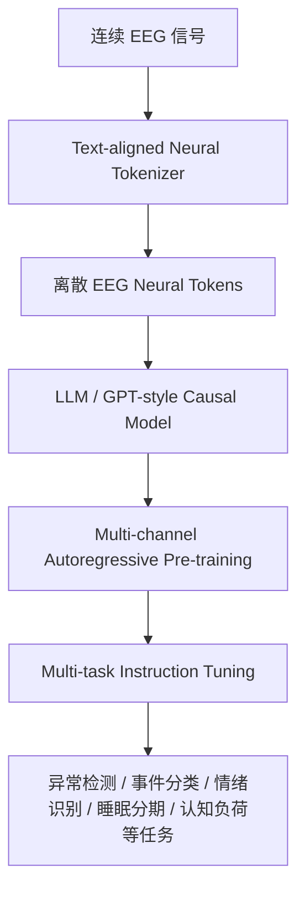
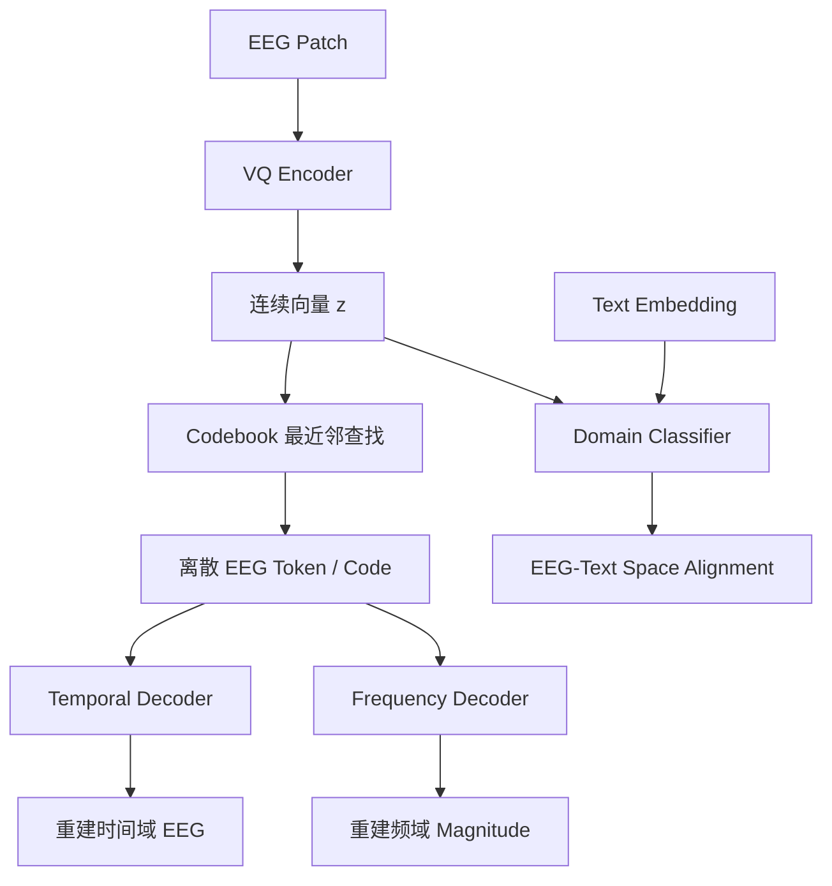
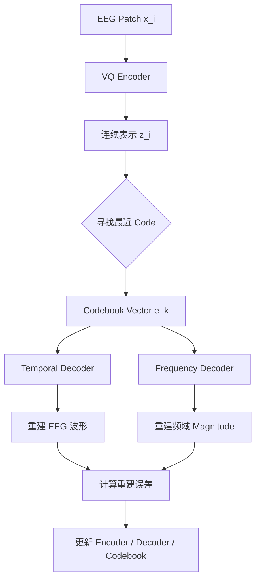
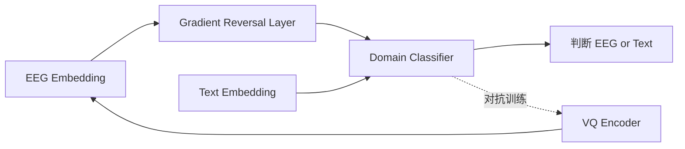
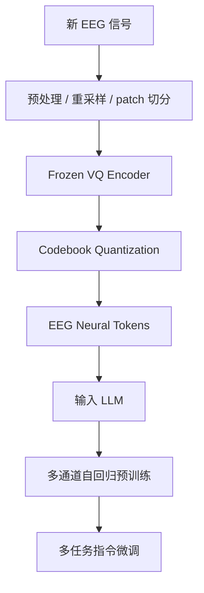
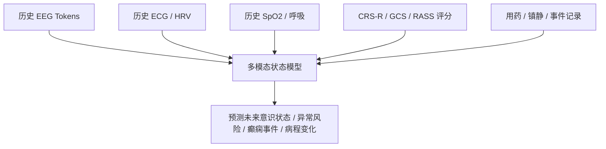
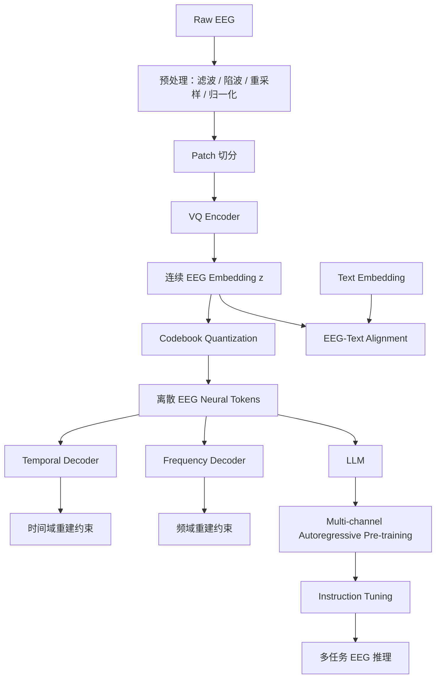

# NeuroLM 论文笔记：Neural Tokenizer、Codebook 与 Multi-Channel Autoregression

> 论文：**NeuroLM: A Universal Multi-task Foundation Model for Bridging the Gap between Language and EEG Signals**  
> arXiv: <https://arxiv.org/abs/2409.00101>  
> 核心思想：将 EEG 脑电信号视作一种“外语”，先把连续 EEG 转换为离散 neural tokens，再接入 LLM，通过多通道自回归预训练与多任务指令微调，实现统一的 EEG 多任务学习。

---

## 1. 论文整体定位

NeuroLM 的目标不是只做一个新的 EEG 分类器，而是尝试构建一个面向 EEG 的多任务基础模型。

传统 EEG 模型通常是：

```text
一个任务 → 一个模型
```

例如：

- 异常 EEG 检测一个模型；
- 癫痫事件识别一个模型；
- 睡眠分期一个模型；
- 情绪识别一个模型；
- 认知负荷分类一个模型。

NeuroLM 想解决的问题是：

```text
一个模型 + 不同指令 → 多种 EEG 任务
```

论文提出的三阶段框架：



论文摘要中明确说明，NeuroLM 首先学习一个 **text-aligned neural tokenizer**，通过 **vector-quantized temporal-frequency prediction** 将 EEG 编码为离散 neural tokens；随后将这些 token 输入 LLM，通过 **multi-channel autoregression** 学习 causal EEG information；最后通过 multi-task instruction tuning 适配多种下游任务。NeuroLM-XL 约 1.7B 参数，预训练数据约 25,000 小时 EEG。

---

## 2. 为什么 EEG 需要 Neural Tokenizer？

LLM 处理的是 token 序列，例如：

```text
我 / 今天 / 很 / 开心
```

但 EEG 是连续多通道时间序列：

```text
Fp1: x1, x2, x3, ...
Fp2: x1, x2, x3, ...
C3 : x1, x2, x3, ...
```

因此如果要让 LLM 处理 EEG，就必须先完成一个转换：

```text
连续 EEG 波形 → 离散 EEG tokens
```

这就是 neural tokenizer 的作用。

它类似于：

| 领域 | Tokenizer 作用 |
|---|---|
| NLP | 文本切分为 token |
| 语音 | 音频 codec 将连续音频转成离散声学 token |
| 图像 | VQ-VAE / VQGAN 将图像 patch 转成视觉 token |
| EEG | Neural tokenizer 将脑电 patch 转成 neural token |

NeuroLM 的 tokenizer 不只是普通离散化模块，而是 **text-aligned neural tokenizer**。也就是说，它不仅要把 EEG 转成 token，还要让 EEG token 的 embedding 尽量接近 LLM 的文本 embedding 空间。

---

## 3. Neural Tokenizer 的输入与输出

假设一段 EEG 信号为：

$$
X \in \mathbb{R}^{C \times T}
$$

其中：

| 符号 | 含义 |
|---|---|
| \(C\) | EEG 通道数 |
| \(T\) | 时间点数量 |
| \(X\) | 多通道 EEG 信号 |

NeuroLM 会先对 EEG 做标准化预处理，再切成 patch。

论文中设置：

```text
patch size = 200
```

由于 EEG 被重采样到 200 Hz，因此一个 patch 大约对应 1 秒 EEG。

例如，一段 10 秒、23 通道 EEG：

```text
每通道 10 个 patch
23 个通道
总 patch 数 = 23 × 10 = 230
```

每个 patch 后续会被编码为一个 neural token。

---

## 4. Neural Tokenizer 的整体结构

NeuroLM 的 neural tokenizer 主要包含以下组件：

| 组件 | 作用 |
|---|---|
| VQ Encoder | 将 EEG patch 编码为连续向量 |
| Codebook | 将连续向量离散化为 token id |
| Temporal Decoder | 根据离散 code 重建时间域 EEG 波形 |
| Frequency Decoder | 根据离散 code 重建频域 magnitude |
| Domain Classifier | 用于 EEG-text embedding 对齐 |

整体结构如下：



---

## 5. VQ Encoder：从 EEG Patch 到连续向量

VQ encoder 的作用是：

$$
x_i \rightarrow z_i
$$

其中：

| 符号 | 含义 |
|---|---|
| \(x_i\) | 第 \(i\) 个 EEG patch |
| \(z_i\) | encoder 输出的连续向量 |

即：

```text
某通道某 1 秒 EEG patch → 高维连续表示 z_i
```

这个 \(z_i\) 还不是 token，它只是一个连续 embedding。

### 5.1 Temporal Encoder

Temporal encoder 主要负责提取 patch 内部的时间特征。

例如：

- 波形起伏；
- 振幅变化；
- 尖波；
- 慢波；
- 节律性活动；
- 高频噪声。

可以理解为：

```text
局部 EEG 波形 → 时间域特征
```

### 5.2 Spatial Encoder

NeuroLM 并不是完全忽略通道信息。

它在 tokenizer 阶段引入了：

- temporal embedding；
- spatial embedding；
- Transformer blocks。

其中 spatial embedding 用于注入 EEG 通道/点位信息，论文中提到与国际 10-20 EEG 系统相关。

因此 tokenizer 阶段至少知道：

```text
这个 patch 来自哪个通道；
这个通道在标准 EEG 点位体系中的位置；
不同通道/patch 之间可以通过 Transformer attention 交互。
```

但需要注意：

> 这属于基于 embedding + attention 的隐式空间建模，而不是显式脑网络拓扑建模。

---

## 6. Codebook 是什么？

Codebook 是 neural tokenizer 的核心。

它本质上是一个可学习矩阵：

$$
E = \{e_1, e_2, \dots, e_K\}
$$

其中：

| 符号 | 含义 |
|---|---|
| \(K\) | codebook 大小，也就是 EEG token 词表大小 |
| \(e_k\) | 第 \(k\) 个 code 向量 |
| \(d\) | 每个 code 向量的维度 |
| \(e_k \in \mathbb{R}^d\) | 一个可学习的脑电模式原型 |

可以理解为：

```text
Codebook = EEG 的离散词表
```

类似 NLP 里：

```text
“脑电” → token id 5001
“异常” → token id 9132
```

NeuroLM 里：

```text
某种 EEG 局部模式 → token id 37
某种 EEG 局部模式 → token id 482
某种 EEG 局部模式 → token id 1590
```

---

## 7. Codebook 是怎么得到的？

Codebook 不是人工定义的，也不是医生提前标注的，而是在 tokenizer 训练过程中自动学习出来的。

训练初期：

```text
codebook 中的向量通常是随机初始化的
```

随着训练进行，encoder 输出的 EEG patch 表征会不断映射到某些 code，decoder 又要求这些 code 能重建 EEG 时间域与频域信息，因此 codebook 会逐渐变成一组有用的 EEG 局部模式原型。

### 7.1 Codebook 查找过程

VQ encoder 输出连续向量：

$$
z_i \in \mathbb{R}^d
$$

Codebook 中有 \(K\) 个候选向量：

$$
e_1, e_2, \dots, e_K
$$

量化时，模型选择距离 \(z_i\) 最近的 code：

$$
q(z_i) = e_k, \quad k = \arg\min_j \| z_i - e_j \|_2
$$

也可以理解为：

```text
z_i 最接近 e_37
所以这个 EEG patch 被编码成 token 37
```

### 7.2 Codebook 学习过程

可以用下面的流程理解：



训练目标会迫使：

```text
相似 EEG patch → 映射到相近或相同的 code
不同 EEG 模式 → 使用不同 code 表示
```

它有点像 K-means，但不是普通 K-means。

普通 K-means：

```text
先提特征 → 再聚类
```

VQ-VAE 式 codebook：

```text
encoder 学特征
codebook 学原型
decoder 学重建
三者端到端联合优化
```

---

## 8. Codebook 学到的 token 有医学语义吗？

不一定。

Codebook 学出来的 token 不是医生手工定义的：

```text
token 37 ≠ 必然是癫痫尖波
token 482 ≠ 必然是 alpha 节律
token 1590 ≠ 必然是肌电伪迹
```

更准确地说：

> codebook 学到的是对 EEG 重建和后续建模有用的离散原型，而不是天然可解释的医学符号。

如果想赋予 codebook 医学解释，需要额外分析：

```text
统计每个 token 在不同任务标签中的出现频率；
可视化某个 token 对应的原始 EEG patch；
分析 token 与频段能量的关系；
分析 token 与异常事件标签的共现关系；
分析 token 在不同脑区/通道中的分布；
分析 token 在不同疾病状态下的富集情况。
```

---

## 9. 为什么要同时重建时间域和频域？

NeuroLM tokenizer 的训练目标不是单纯重建原始波形，而是同时重建：

```text
1. 时间域 EEG 波形
2. 频域 magnitude
```

这被称为：

```text
temporal-frequency prediction
```

### 9.1 时间域重建

时间域重建要求：

$$
\hat{x}_i \approx x_i
$$

即：

```text
token 解码后能还原原始 EEG 波形
```

时间域信息对以下现象很重要：

| 时间域特征 | 可能意义 |
|---|---|
| 尖波 / 棘波 | 癫痫样放电 |
| 慢波 | 意识障碍、睡眠、异常脑活动 |
| 爆发-抑制 | 深度昏迷、麻醉状态 |
| 局部突变 | 事件、运动伪迹、眼动伪迹 |
| 波形连续性 | 背景节律状态 |

### 9.2 频域重建

频域重建要求：

$$
\hat{F}(x_i) \approx F(x_i)
$$

其中 \(F(x_i)\) 表示 EEG patch 的频域 magnitude。

频域信息对 EEG 极其重要：

| 频段 | 常见相关场景 |
|---|---|
| Delta | 睡眠、意识障碍、慢波活动 |
| Theta | 疲劳、认知负荷、记忆 |
| Alpha | 放松、闭眼节律、静息态 |
| Beta | 警觉、运动相关、紧张 |
| Gamma | 高阶认知、局部神经活动 |

因此，NeuroLM 希望 codebook 不仅记住波形形态，还能保留频谱结构。

---

## 10. NeuroLM Tokenizer 与 LaBraM Tokenizer 的区别

NeuroLM 的 tokenizer 受到 LaBraM 启发，但做了关键改造。

| 对比项 | LaBraM | NeuroLM |
|---|---|---|
| 核心目标 | EEG 表征学习 | EEG 表征学习 + LLM 接入 |
| 离散化方式 | Neural tokenizer / VQ | Text-aligned neural tokenizer / VQ |
| 重建目标 | 偏傅里叶 amplitude + phase | 时间域波形 + 频域 magnitude |
| 是否对齐文本空间 | 否 | 是 |
| 后续模型 | EEG foundation model | LLM-style EEG-language model |

最重要的区别是：

```text
LaBraM tokenizer:
学到好的 EEG representation

NeuroLM tokenizer:
学到能被 LLM 接收的 EEG token representation
```

---

## 11. EEG-Text Alignment：为什么需要文本空间对齐？

LLM 原本只理解文本 token embedding。

如果 EEG embedding 与文本 embedding 分布差距太大，那么即使把 EEG token 喂给 LLM，LLM 也可能把它当成“乱码”。

所以 NeuroLM 的 tokenizer 增加了 text-aligned 机制。

目标是：

```text
EEG embedding space ≈ Text embedding space
```

但 EEG 有一个难点：

> EEG 很难构造大规模高质量 EEG-text pairs。

一段 EEG 可能同时包含：

- 情绪状态；
- 认知负荷；
- 疾病异常；
- 睡眠状态；
- 药物影响；
- 眼电伪迹；
- 肌电伪迹；
- 个体差异。

很难用一句自然语言准确描述。

因此 NeuroLM 没有做细粒度 EEG-text pair alignment，而是做粗粒度的 **space-wise alignment**。

### 11.1 Domain Classifier + Gradient Reversal Layer

NeuroLM 使用 domain classifier 判断 embedding 来自 EEG 还是 text：

```text
输入 embedding → 判断来源：EEG / Text
```

同时引入 Gradient Reversal Layer，形成对抗训练：



训练过程中：

```text
Domain Classifier:
努力区分 EEG embedding 和 text embedding

VQ Encoder:
努力生成让 Domain Classifier 分不清来源的 EEG embedding
```

最终希望：

```text
EEG embedding 分布靠近 text embedding 分布
```

这样后续 LLM 才更容易处理 EEG tokens。

---

## 12. Tokenizer 训练目标总结

NeuroLM neural tokenizer 的训练目标可以概括为：

$$
\mathcal{L}_{tokenizer}
=
\mathcal{L}_{temp}
+
\mathcal{L}_{freq}
+
\mathcal{L}_{vq}
+
\mathcal{L}_{align}
$$

其中：

| Loss | 含义 |
|---|---|
| \(\mathcal{L}_{temp}\) | 时间域重建损失 |
| \(\mathcal{L}_{freq}\) | 频域 magnitude 重建损失 |
| \(\mathcal{L}_{vq}\) | VQ / codebook 学习损失 |
| \(\mathcal{L}_{align}\) | EEG-text 对齐损失 |

直观理解：

```text
temporal loss:
要求 token 能还原 EEG 波形

frequency loss:
要求 token 能还原频谱结构

VQ loss:
要求 encoder 输出靠近 codebook 原型

alignment loss:
要求 EEG embedding 靠近文本 embedding 空间
```

---

## 13. Tokenizer 训练完成后如何使用？

训练完成后，NeuroLM 会冻结 VQ encoder，用它把 EEG 编码成离散 EEG tokens。

流程如下：



最终输入 LLM 的可以是：

```text
<eeg_102> <eeg_355> <eeg_741> ... [SEP] Question: Is this EEG abnormal? Answer:
```

这就是 NeuroLM 把 EEG 和语言统一到一个模型中的关键。

---

## 14. NeuroLM 是否建模 EEG 点位空间关系？

结论：

> NeuroLM 有做通道位置和跨通道交互建模，但不是强显式空间建模。

### 14.1 它做了什么空间建模？

在 tokenizer 阶段：

```text
spatial embedding + Transformer spatial encoder
```

在 LLM 预训练阶段：

```text
spatial embedding + multi-channel autoregression
```

因此它至少考虑了：

- patch 来自哪个通道；
- 不同通道之间可以通过 attention 交互；
- 预测未来 token 时可以利用历史时间点上的多通道信息。

### 14.2 它没有充分建模什么？

NeuroLM 没有显式引入：

```text
电极物理距离矩阵；
10-20/10-10 点位拓扑图；
脑区分组先验；
左右半球对称关系；
功能连接矩阵，如 coherence、PLI、PLV；
源定位 source localization；
临床 montage，如 bipolar montage / referential montage；
图神经网络 GNN；
异常传播路径建模。
```

因此它的空间建模属于：

```text
embedding + attention 的隐式学习
```

而不是：

```text
基于脑电拓扑/脑区连接/临床 montage 的显式空间建模
```

### 14.3 对医疗 EEG 的影响

如果任务是临床 EEG、ICU 监护、癫痫、意识障碍，则空间结构非常重要。

医生通常关心：

```text
异常来自哪些导联？
是局灶性还是弥漫性？
左半球还是右半球？
前额、颞区、中央区、顶枕区哪个区域更明显？
是否有传播？
是否存在左右不对称？
是否符合某种 montage 下的异常模式？
```

NeuroLM 当前设计能学到一部分，但可解释性和临床空间先验仍然不足。

---

## 15. Multi-Channel Autoregression：为什么重要？

Multi-Channel Autoregression 是 NeuroLM 中非常关键的设计。

普通 GPT 的自回归适合一维文本序列：

```text
token_1 → token_2 → token_3 → token_4
```

但 EEG 是二维结构：

```text
Channel × Time
```

例如：

```text
          t1   t2   t3

Fp1       a    b    c
Fp2       d    e    f
F3        g    h    i
```

如果简单把 EEG tokens 拉平成一维序列，会破坏 EEG 的时空结构。

---

## 16. 普通 Flatten EEG Token 的问题

假设有 3 个通道、3 个时间点：

```text
Fp1_t1, Fp1_t2, Fp1_t3
Fp2_t1, Fp2_t2, Fp2_t3
F3_t1,  F3_t2,  F3_t3
```

如果直接 flatten 成：

```text
Fp1_t1 → Fp1_t2 → Fp1_t3 → Fp2_t1 → Fp2_t2 → Fp2_t3 → F3_t1 ...
```

模型会错误地认为：

```text
Fp1_t3 的下一个 token 是 Fp2_t1
```

但实际上：

```text
Fp1_t3 和 Fp2_t1 并不是时间上的连续关系
它们只是 flatten 后相邻
```

这会混淆：

- 时间关系；
- 空间关系；
- 跨通道同步关系；
- 脑区传播关系。

---

## 17. NeuroLM 对 EEG 的二维表示

NeuroLM 将 EEG token 表示为：

$$
h_{i,j}
$$

其中：

| 符号 | 含义 |
|---|---|
| \(i\) | EEG 通道 |
| \(j\) | 时间位置 |

即：

```text
h_{channel, time}
```

例如：

```text
h_{Fp1,1}, h_{Fp1,2}, h_{Fp1,3}
h_{Fp2,1}, h_{Fp2,2}, h_{Fp2,3}
h_{F3,1},  h_{F3,2},  h_{F3,3}
```

---

## 18. Multi-Channel Autoregression 的核心目标

普通 GPT 预测：

$$
P(x_t \mid x_1, x_2, \dots, x_{t-1})
$$

即：

```text
根据过去 token 预测下一个 token
```

NeuroLM 的 multi-channel autoregression 预测：

$$
P(h_{i,t+1} \mid H_{\leq t})
$$

其中：

$$
H_{\leq t} = \{h_{c,\tau} \mid c = 1,\dots,C;\ \tau \leq t\}
$$

也就是说：

```text
根据所有通道过去时刻的信息
预测每个通道下一时刻的 token
```

核心区别：

| 模型 | 预测方式 |
|---|---|
| 普通 GPT | 根据过去一维 token 预测下一个 token |
| NeuroLM MCA | 根据过去时间点的所有通道 token，预测每个通道下一时刻 token |

---

## 19. Stair-Stepping Mask

Multi-channel autoregression 的关键实现是：

```text
stair-stepping attention mask
```

假设有 3 个通道、3 个时间点：

```text
          t1      t2      t3
Fp1       A       D       G
Fp2       B       E       H
F3        C       F       I
```

模型在预测 t2 时，应该可以看到 t1 的所有通道：

```text
预测 Fp1_t2，可以看 Fp1_t1, Fp2_t1, F3_t1
预测 Fp2_t2，可以看 Fp1_t1, Fp2_t1, F3_t1
预测 F3_t2，可以看 Fp1_t1, Fp2_t1, F3_t1
```

但不能看到 t2 或 t3 的内容：

```text
不能看 Fp1_t2, Fp2_t2, F3_t2
不能看未来 t3
```

这形成一种按时间台阶展开的 mask。

示意图：

```text
允许 attention：

t1 → t2
t1,t2 → t3
t1,t2,t3 → t4
```

更抽象地说：

```text
每个目标 token h_{i,t+1}
只能关注所有通道中时间 ≤ t 的 tokens
```

即：

$$
\text{Visible}(h_{i,t+1})
=
\{h_{c,\tau} \mid c = 1,\dots,C,\ \tau \leq t\}
$$

---

## 20. Multi-Channel Autoregression 学到了什么？

### 20.1 时间动态

例如 alpha 节律、慢波、睡眠节律、事件演化等，都具有时间连续性。

MCA 学习：

```text
过去脑电状态 → 下一时刻脑电状态
```

### 20.2 跨通道同步

很多 EEG 活动不是单通道孤立出现，而是在多个通道同步出现。

例如：

```text
左右半球同步慢波
中央区睡眠纺锤波
全脑弥漫性慢化
```

MCA 可以让模型在预测某个通道未来 token 时利用其他通道的历史 token。

### 20.3 空间传播

某些异常活动可能有空间传播特征，例如癫痫样放电。

```text
颞区 → 中央区 → 顶区
```

MCA 通过多通道历史上下文，有机会学习这种传播模式。

### 20.4 脑区耦合

认知负荷、情绪、意识状态可能体现为不同脑区频段变化的组合。

例如：

```text
前额 theta 增强
顶叶 alpha 下降
```

MCA 可以在跨通道 token 关系中捕获这种耦合。

---

## 21. MCA 与 Masked EEG Modeling 的区别

很多 EEG foundation model 使用 masked modeling，例如：

```text
随机 mask 一些 EEG patch
模型重建被 mask 的 patch
```

这类似 BERT / MAE。

其核心是：

```text
从上下文恢复缺失片段
```

而 NeuroLM 的 MCA 更像 GPT：

```text
根据过去预测未来
```

对比：

| 方法 | 学习目标 | 特点 |
|---|---|---|
| Masked EEG Modeling | 重建被遮盖 patch | 更偏静态上下文恢复 |
| Multi-channel Autoregression | 预测未来 EEG token | 更偏动态演化建模 |
| 普通 GPT 自回归 | 预测下一个文本 token | 一维语言序列 |
| NeuroLM MCA | 预测每个通道下一时刻 token | 多通道脑电时间序列 |

从脑电角度看，MCA 更贴近 EEG 的动态神经活动本质。

---

## 22. 为什么 MCA 是 NeuroLM 的关键创新？

NeuroLM 的 tokenizer 解决的是：

```text
EEG 如何变成 token？
```

MCA 解决的是：

```text
LLM 如何正确学习多通道 EEG token 的时空动态？
```

如果没有 MCA，只是简单把 EEG token 拉平成文本序列，模型可能学到错误的相邻关系。

MCA 的意义是：

```text
保留 EEG 的 Channel × Time 结构
让模型基于所有通道历史信息预测未来状态
学习 EEG 的 causal dynamics
```

---

## 23. NeuroLM 的多任务指令微调

完成 tokenizer 和 MCA 预训练后，NeuroLM 进入 instruction tuning 阶段。

输入形式类似：

```text
<EEG tokens> [SEP] Question: Is this EEG segment abnormal? Answer:
```

或者：

```text
<EEG tokens> [SEP] Question: Which class does this EEG segment belong to?
Options: A. background B. seizure C. slowing
Answer:
```

模型输出文本答案：

```text
Yes
No
A
B
C
```

这将 EEG 分类问题转化为：

```text
EEG-conditioned language generation
```

即：

```text
给定 EEG tokens + 任务指令 → 生成答案
```

这就是 NeuroLM 的多任务统一能力来源。

---

## 24. 对医疗 EEG / ICU / 意识障碍项目的启发

NeuroLM 对医疗 EEG 项目的最大启发不是简单复现 1.7B 模型，而是它提供了一条技术路线：

```text
EEG 信号
→ neural tokenizer
→ EEG token vocabulary
→ 多通道时序预训练
→ 指令化任务适配
→ 临床解释输出
```

### 24.1 可以构建“脑电任务指令化平台”

未来系统可以支持：

```text
请判断这段 EEG 是否异常。
请判断是否存在癫痫样放电。
请判断是否存在弥漫性慢化。
请判断左右半球是否不对称。
请判断当前意识状态是否较前改善。
请结合 ECG/HRV 判断患者状态是否稳定。
```

### 24.2 ICU 场景下可以扩展为多模态自回归

NeuroLM 是 EEG multi-channel autoregression。

ICU 场景可以进一步扩展为：

```text
EEG + ECG + HRV + SpO2 + 呼吸 + 临床评分
```

即：

```text
Multi-modal Autoregression
```

示意：



可以形成：

```text
过去 10 分钟生理状态
→ 预测未来 30 分钟异常风险或意识状态变化
```

### 24.3 需要补强临床可解释性

NeuroLM 当前更偏统一建模范式，临床落地还需要补强：

```text
通道级 saliency；
频段贡献分析；
topomap 可视化；
异常事件时间定位；
左右半球对称分析；
局灶性/弥漫性判断；
与 CRS-R / GCS 等评分关联；
医生可读报告生成。
```

---

## 25. 总结：NeuroLM 的关键技术链条

可以用一张总图概括：



---

## 26. 一句话总括

NeuroLM 的核心不是简单把 EEG 喂给 GPT，而是先通过 **text-aligned neural tokenizer** 将连续 EEG 转换为离散 neural tokens，再通过 **codebook** 形成 EEG 的“词表”，并用 temporal-frequency prediction 保留脑电的时间域与频域结构；随后通过 **multi-channel autoregression** 让 LLM 基于所有通道的历史 token 预测每个通道的未来 token，从而学习 EEG 的多通道时空动态；最后通过 instruction tuning，把异常检测、事件分类、睡眠分期、情绪识别、认知负荷分类等任务统一为 EEG-conditioned language generation。

