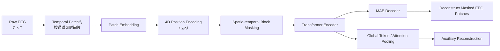
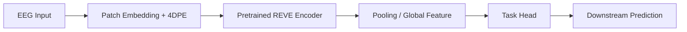
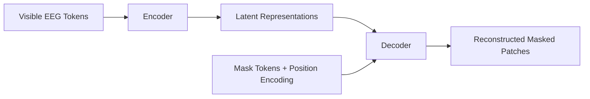
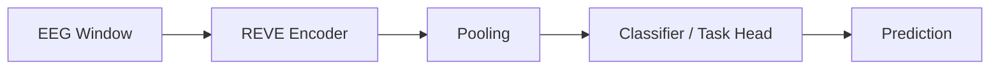
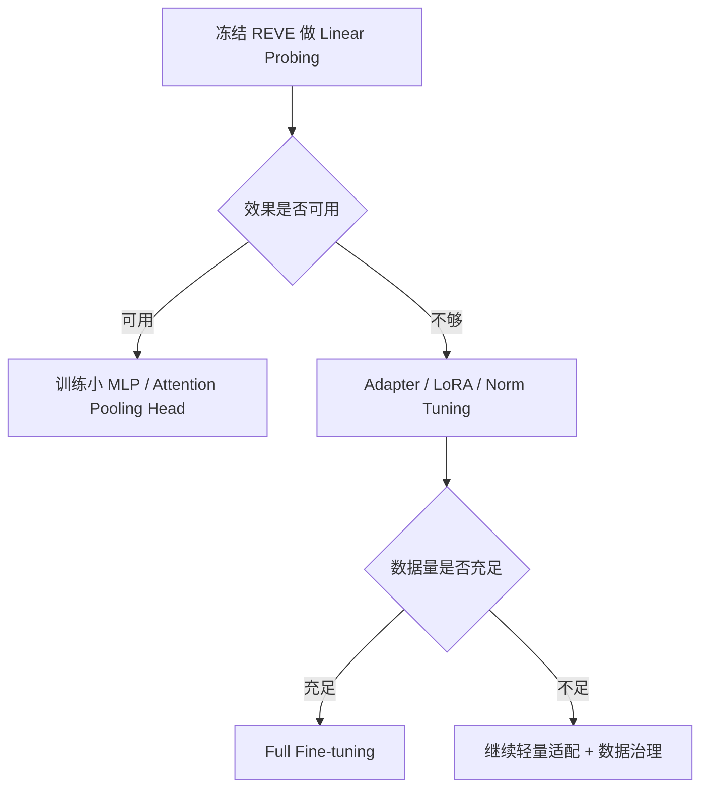
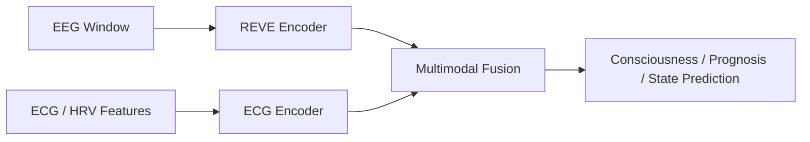

# REVE 论文解读笔记

> 论文：**REVE: A Foundation Model for EEG — Adapting to Any Setup with Large-Scale Pretraining on 25,000 Subjects**  
> 核心关键词：EEG Foundation Model、4D Position Encoding、Fourier Features、Masked Autoencoding、跨导联/跨设备迁移、Linear Probing、Few-shot EEG  
> 笔记整理：基于论文内容与前述讨论整理

---

## 1. 一句话概括

**REVE 的核心贡献，是把 EEG token 的位置从“通道编号 + 时间编号”升级为“头皮三维空间坐标 + 时间 patch 坐标”，并基于大规模异质 EEG 数据做 masked autoencoding 预训练，从而提升模型对不同通道数、不同电极布局、不同导联设置和不同下游任务的迁移能力。**

换句话说，REVE 不希望模型死记：

```text
第 1 个通道、第 2 个通道、第 3 个通道……
```

而是希望模型知道：

```text
这个信号来自额区、这个信号来自中央区、这个信号来自枕区；
这个 patch 是该通道第几秒的 EEG 片段。
```

---

## 2. 论文试图解决的问题

EEG 数据与图像、文本不同，它存在很强的采集异质性：

- 不同设备的通道数不同；
- 不同数据集的电极布局不同；
- 不同实验任务的时间窗不同；
- 同一通道可能存在不同参考方式；
- 临床 EEG 里常见单极导联、双极导联、平均参考、耳垂参考等不同 montage；
- 不同被试头型、电极帽、电极放置误差会带来空间偏移；
- EEG 噪声大、伪迹多、跨被试差异明显。

传统 EEG 模型常常依赖固定通道顺序或固定通道集合。例如模型训练时输入是：

```text
[Fp1, Fp2, F3, F4, C3, C4, P3, P4, O1, O2]
```

如果测试时通道顺序变化，或者变成 19 导、32 导、64 导，模型就容易失效。

REVE 要解决的问题是：

> **如何训练一个能够适配任意 EEG 电极布局和任意时间长度的基础模型？**

---

## 3. REVE 的整体框架

REVE 是一个基于 Transformer 的 EEG masked autoencoder。

整体流程如下：



预训练完成后：



预训练阶段需要 decoder；下游任务通常丢弃 decoder，只保留 encoder 作为通用 EEG 表征提取器。

---

## 4. 输入表示：EEG 如何变成 token

原始 EEG 记为：

$$
X \in \mathbb{R}^{C \times T}
$$

其中：

- $C$：通道数；
- $T$：时间采样点数。

每个通道都有三维空间坐标：

$$
P_c = (x_c, y_c, z_c)
$$

然后对每个通道沿时间维度切 patch。

假设采样率为 200Hz，patch size 为 200 个采样点，则每个 patch 约为 1 秒。

如果一段 EEG 有 19 个通道、长度 10 秒，则：

$$
\text{token 数} = 19 \times 10 = 190
$$

每个 token 对应：

```text
某个电极位置上的某个时间片段
```

例如：

| token | 通道 | 时间 patch | 4D 位置 |
|---|---|---|---|
| token 1 | Fp1 | 0 | $(x_{Fp1}, y_{Fp1}, z_{Fp1}, 0)$ |
| token 2 | Fp1 | 1 | $(x_{Fp1}, y_{Fp1}, z_{Fp1}, 1)$ |
| token 3 | C3 | 0 | $(x_{C3}, y_{C3}, z_{C3}, 0)$ |
| token 4 | C3 | 1 | $(x_{C3}, y_{C3}, z_{C3}, 1)$ |
| token 5 | O1 | 0 | $(x_{O1}, y_{O1}, z_{O1}, 0)$ |

---

## 5. 通道空间坐标如何获取

REVE 需要每个通道的三维空间坐标：

$$
(x,y,z)
$$

这些坐标通常不是从 EEG 波形中自动推断出来的，而是由通道名或 montage 信息映射得到。

### 5.1 标准 10-20 / 10-10 / 10-5 系统

如果数据集中有标准通道名：

```text
Fp1, Fp2, F3, F4, C3, C4, P3, P4, O1, O2
```

则可以通过标准头模查表获得坐标。

例如：

| 通道 | 大致位置 |
|---|---|
| Fp1 / Fp2 | 额极区 |
| F3 / F4 | 额叶 |
| C3 / C4 | 中央区，运动皮层附近 |
| P3 / P4 | 顶叶 |
| O1 / O2 | 枕叶 |

工程中常用 MNE：

```python
import mne

montage = mne.channels.make_standard_montage("standard_1020")
ch_pos = montage.get_positions()["ch_pos"]

print(ch_pos["C3"])
```

### 5.2 数据集自带坐标文件

某些 BIDS EEG 数据集可能包含：

```text
*_electrodes.tsv
*_coordsystem.json
*_channels.tsv
```

如果有真实采集坐标，应优先使用真实坐标。

### 5.3 通道名清洗

临床 EEG 数据中通道名可能写成：

```text
EEG C3-Ref
C3-A2
EEG Fp1-LE
```

需要先清洗为标准电极名：

```text
C3
Fp1
```

再查标准坐标。

---

## 6. 4D Fourier-Based Position Encoding

### 6.1 为什么是 4D

每个 EEG token 同时具有：

1. 空间位置：来自哪个电极；
2. 时间位置：该通道上的第几个 patch。

所以 REVE 用四维坐标表示 token 位置：

$$
q_{c,n} = (x_c, y_c, z_c, t_n)
$$

其中：

- $(x_c,y_c,z_c)$：第 $c$ 个电极的三维坐标；
- $t_n$：第 $n$ 个时间 patch 的位置。

这比传统通道编号更灵活：

```text
Channel ID → 固定、离散、不可外推
4D 坐标函数 → 连续、可外推、可适配新电极布局
```

---

### 6.2 空间坐标加高斯噪声

训练时，REVE 会对空间坐标加入小的高斯噪声：

$$
\tilde{P}_c = P_c + \epsilon
$$

$$
\epsilon \sim \mathcal{N}(0,\sigma^2)
$$

目的：

- 增强对头型差异的鲁棒性；
- 增强对电极放置误差的鲁棒性；
- 避免模型死记固定坐标；
- 让模型学习“脑区附近”的模式，而不是单个绝对点。

---

### 6.3 时间坐标缩放

时间 patch index 是离散值：

$$
t = 0,1,2,\dots,N-1
$$

由于时间 index 的尺度可能远大于空间坐标，因此通常需要缩放：

$$
\tilde{t} = \alpha t
$$

最终的 4D 坐标为：

$$
q = (\tilde{x}, \tilde{y}, \tilde{z}, \tilde{t})
$$

这样可以避免时间维度在数值上主导空间维度。

---

### 6.4 Fourier 编码基本思想

对一个坐标 $u$，Fourier feature 可以表示为：

$$
\gamma(u)=
[
\sin(2\pi f_1 u),
\cos(2\pi f_1 u),
\dots,
\sin(2\pi f_K u),
\cos(2\pi f_K u)
]
$$

其中 $f_1,\dots,f_K$ 是不同频率。

低频负责粗尺度关系，高频负责细尺度差异。

对 EEG 来说：

| 频率 | 表达能力 |
|---|---|
| 低频空间特征 | 额区、中央区、枕区等大脑区差异 |
| 高频空间特征 | C3、Cz、C4 等相邻电极差异 |
| 低频时间特征 | 前半段、后半段等长程时间关系 |
| 高频时间特征 | 相邻 patch 的细粒度时间差异 |

---

### 6.5 4D Cartesian Product Fourier Encoding

对于 4D 坐标：

$$
q=(x,y,z,t)
$$

REVE 使用 4 个维度的频率组合。可理解为对频率向量：

$$
\omega = (f_x, f_y, f_z, f_t)
$$

计算：

$$
\sin(2\pi \omega^\top q)
$$

$$
\cos(2\pi \omega^\top q)
$$

即：

$$
\sin(2\pi(f_x x + f_y y + f_z z + f_t t))
$$

$$
\cos(2\pi(f_x x + f_y y + f_z z + f_t t))
$$

如果每个维度有 $K$ 个频率，则频率组合数为：

$$
K^4
$$

每个组合有 sin 和 cos 两个分量，因此 Fourier 特征维度为：

$$
2K^4
$$

这种 Cartesian product 结构的意义是：

> 它不是分别编码 x、y、z、t，而是编码空间与时间的联合位置模式。

---

### 6.6 与逐维拼接的区别

逐维拼接：

$$
[\gamma(x), \gamma(y), \gamma(z), \gamma(t)]
$$

只能告诉模型：

```text
空间在哪里，时间在哪里
```

4D 联合 Fourier 编码：

$$
\gamma(x,y,z,t)
$$

可以表达：

```text
某个空间位置在某个时间点的联合模式
```

这对 EEG 很重要，因为脑电模式天然是时空耦合的。例如：

- C3 第 1 秒与 C4 第 1 秒的左右半球关系；
- C3 第 1 秒与 C4 第 2 秒的跨时空关系；
- 枕区 alpha 在一段时间内的持续性；
- 中央区运动想象 ERD/ERS 的空间-时间变化。

---

### 6.7 可学习线性分支

REVE 的位置编码不只是固定 Fourier features，还加入一个可学习线性分支：

$$
F_{\text{lin}} =
\text{LayerNorm}
\left(
\text{GELU}
\left(
\text{Linear}(q)
\right)
\right)
$$

Fourier 分支得到：

$$
F_{\text{pe}} = \text{FourierPE}(q)
$$

最终位置编码：

$$
P_{\text{enc}} =
\text{LayerNorm}
\left(
F_{\text{pe}} + F_{\text{lin}}
\right)
$$

可以理解为：

| 分支 | 作用 |
|---|---|
| Fourier 分支 | 提供连续、多尺度、可外推的位置先验 |
| Linear/GELU 分支 | 提供数据驱动的位置适配能力 |
| LayerNorm | 稳定两者融合后的尺度 |

---

### 6.8 加到 EEG patch embedding 上

每个 EEG patch 先得到内容 embedding：

$$
e_{c,n} = \text{PatchEmbed}(X_{c,n})
$$

再加位置编码：

$$
z_{c,n}
=
e_{c,n}
+
P_{\text{enc}}(x_c,y_c,z_c,t_n)
$$

Transformer 看到的 token 同时包含：

```text
EEG 波形内容 + 头皮空间位置 + 时间 patch 位置
```

---

## 7. 4DPE 为什么能适配任意导联布局

传统 learned positional embedding 是查表：

$$
PE[channel\_id, time\_id]
$$

问题是：

- 新通道没见过，表里没有；
- 新通道顺序变化，语义混乱；
- 更长时间序列可能超过位置表范围。

REVE 的 4DPE 是函数：

$$
P_{\text{enc}} = f(x,y,z,t)
$$

只要知道新通道的坐标，就能生成位置编码。

例如训练时没见过 CP1，但测试时有 CP1：

$$
CP1 \rightarrow f(x_{CP1},y_{CP1},z_{CP1},t)
$$

所以它可以更自然地适配：

- 8 导、19 导、32 导、64 导；
- 标准 10-20、10-10、10-5；
- 某些缺失通道；
- 不同电极顺序；
- 更长时间窗口。

---

## 8. 单极导联与双极导联的数据迁移

### 8.1 单极导联：点信号

单极导联或参考导联可写为：

$$
V_i = \phi(E_i) - \phi(R)
$$

其中：

- $E_i$：某个电极；
- $R$：参考点或参考方式；
- $\phi(E_i)$：电极电位；
- $\phi(R)$：参考电位。

例如：

```text
C3-Ref
Fp1-Ref
O1-Ref
```

单极导联可以自然放在该电极坐标上：

$$
P = P_i
$$

---

### 8.2 双极导联：边信号

双极导联可写为：

$$
V_{i-j} = \phi(E_i) - \phi(E_j)
$$

例如：

```text
Fp1-F7
F7-T3
T3-T5
T5-O1
```

它不是某一个点的电位，而是两个电极之间的差分信号。

因此双极导联更像“边信号”，不是“点信号”。

---

### 8.3 单极到双极：相对可靠

如果单极通道共享同一个参考 $R$：

$$
V_i = \phi(E_i)-\phi(R)
$$

$$
V_j = \phi(E_j)-\phi(R)
$$

则：

$$
V_i - V_j
=
[\phi(E_i)-\phi(R)] - [\phi(E_j)-\phi(R)]
$$

$$
V_i - V_j
=
\phi(E_i)-\phi(E_j)
$$

所以可以构造双极导联：

$$
V_{i-j}=V_i-V_j
$$

工程示例：

```python
Fp1_F7 = X["Fp1"] - X["F7"]
F7_T3  = X["F7"]  - X["T3"]
T3_T5  = X["T3"]  - X["T5"]
T5_O1  = X["T5"]  - X["O1"]
```

---

### 8.4 双极导联的位置坐标

原版 REVE 需要每个通道一个三维坐标。

对双极通道 $E_i-E_j$，最常用近似是取中点：

$$
P_{i-j}
=
\frac{P_i + P_j}{2}
$$

例如：

$$
P_{Fp1-F7}
=
\frac{P_{Fp1}+P_{F7}}{2}
$$

然后 4D 位置为：

$$
(x_{mid}, y_{mid}, z_{mid}, t)
$$

---

### 8.5 中点坐标的不足：无法表示方向

因为：

$$
Fp1-F7 \neq F7-Fp1
$$

二者只差一个负号：

$$
V_{F7-Fp1} = -V_{Fp1-F7}
$$

但中点坐标相同。

因此，更理想的双极导联编码应包含方向向量：

$$
D_{i-j}=P_i-P_j
$$

可以扩展为：

$$
(x_{mid},y_{mid},z_{mid},d_x,d_y,d_z,t)
$$

这已经超出原版 REVE 的 4DPE，但对临床双极 montage 很有价值。

---

### 8.6 双极到单极：只能近似恢复

双极观测可以看作图上的边差分：

$$
\mathbf{b}=A\mathbf{v}
$$

其中：

- $\mathbf{v}$：节点电极电位；
- $\mathbf{b}$：双极差分信号；
- $A$：incidence matrix。

想从双极恢复单极，需要求：

$$
\hat{\mathbf{v}}
=
\arg\min_{\mathbf{v}}
\|A\mathbf{v}-\mathbf{b}\|_2^2
$$

但该问题存在常数偏移不可辨识性，因为所有电极同时加一个常数，双极差分不变。

需要加约束，例如平均参考：

$$
\sum_i v_i = 0
$$

因此：

> **单极到双极可以相对可靠地差分构造；双极到单极只能在额外参考约束下近似恢复。**

---

### 8.7 单极/双极混合数据的推荐处理

| 场景 | 推荐做法 |
|---|---|
| 单极数据迁移到双极任务 | 按目标 bipolar montage 做差分 |
| 双极数据输入原版 REVE | 用端点中点坐标 |
| 双极数据输入改造版模型 | 中点坐标 + 方向向量 |
| 单极/双极混合训练 | 增加 montage type / reference embedding |
| 临床多中心数据 | 保留完整 montage metadata |

建议保存的 metadata：

| 字段 | 含义 |
|---|---|
| channel_name | 原始通道名 |
| channel_type | EEG/EOG/ECG/EMG |
| montage_type | referential/bipolar/average_ref |
| anode | 双极正端 |
| cathode | 双极负端或参考 |
| x,y,z | 点坐标或中点坐标 |
| dx,dy,dz | 双极方向向量 |
| reference | Cz/A1/A2/average/unknown |
| sampling_rate | 采样率 |
| preprocessing | 滤波、标准化等 |

---

## 9. REVE 的预训练策略

### 9.1 总体目标

REVE 采用 masked autoencoding 自监督预训练。

目标是：

```text
遮住一部分 EEG patch → 根据可见 patch 重建被遮住 patch
```

数学上：

$$
\hat{X}_{\mathcal{M}}
\approx
X_{\mathcal{M}}
$$

其中：

- $\mathcal{M}$：被 mask 的 patch 集合；
- $\hat{X}_{\mathcal{M}}$：模型重建的 EEG patch；
- $X_{\mathcal{M}}$：真实 EEG patch。

---

### 9.2 大规模异质 EEG 数据

REVE 使用大规模、多来源 EEG 数据进行预训练：

- 92 个 EEG 数据源；
- 超过 60,000 小时 EEG；
- 约 25,000 名受试者；
- 涵盖多种任务、多种设备、多种电极布局。

数据异质性本身就是训练目标的一部分：模型被迫学习跨 montage、跨设备、跨任务的通用 EEG 表征。

---

### 9.3 预处理策略

主要包括：

1. 统一重采样到 200Hz；
2. 带通滤波；
3. session-level z-score 标准化；
4. 极值裁剪；
5. 删除过短片段；
6. 避免下游测试数据泄漏。

session-level z-score：

$$
X' =
\frac{X-\mu_{\text{session}}}
{\sigma_{\text{session}}}
$$

目的：

- 减少设备幅值差异；
- 减少个体幅值差异；
- 让模型更关注波形结构而非绝对幅度。

---

### 9.4 时空 block masking

REVE 不使用简单随机 mask，而使用 spatio-temporal block masking。

原因是 EEG 在时间和空间上都有强相关性：

- 相邻时间 patch 类似；
- 相邻电极信号相关；
- 随机 mask 太容易被插值恢复。

block masking 会遮住连续时空区域，使任务更难：

```text
随机 mask：
C3 第 2 秒、O1 第 5 秒、Fp1 第 8 秒

block mask：
中央区附近多个通道 + 连续若干秒
```

这样迫使模型学习：

- 时间上下文；
- 空间邻域关系；
- 跨通道依赖；
- 全局脑状态；
- EEG 节律结构。

---

### 9.5 Encoder 与 Decoder

预训练时：



Encoder 只看可见 token：

$$
H_{\mathcal{V}} =
\text{Encoder}(Z_{\mathcal{V}})
$$

Decoder 负责重建 masked token：

$$
\hat{X}_{\mathcal{M}}
=
\text{Decoder}(H_{\mathcal{V}}, \text{MaskTokens})
$$

---

### 9.6 主重建损失：L1 Loss

主损失为 masked patches 的 L1 重建损失：

$$
\mathcal{L}_{main}
=
\frac{1}{|\mathcal{M}|}
\sum_{(c,n)\in \mathcal{M}}
\left\|
\hat{X}_{c,n}-X_{c,n}
\right\|_1
$$

选择 L1 的原因：

- EEG 噪声和伪迹多；
- L2 对异常尖峰过于敏感；
- L1 对极端值更鲁棒。

---

### 9.7 辅助重建任务：Global Token

REVE 还引入全局 token 辅助重建。

流程：

1. 从 encoder 多层 hidden states 中聚合信息；
2. 通过 attention pooling 得到 global token；
3. 用 global token 重建 masked EEG；
4. 形成辅助损失。

表示为：

$$
g =
\text{AttentionPooling}
(H^{(1)},H^{(2)},...,H^{(L)})
$$

辅助损失：

$$
\mathcal{L}_{aux}
=
\left\|
\hat{X}^{global}_{\mathcal{M}}
-
X_{\mathcal{M}}
\right\|_1
$$

总损失：

$$
\mathcal{L}
=
\mathcal{L}_{main}
+
\lambda \mathcal{L}_{aux}
$$

意义：

- 避免 encoder 只服务局部重建；
- 促使模型形成全局 EEG 表征；
- 提升 linear probing 和 few-shot 表现；
- 更贴近下游分类/检测任务对全局状态的需求。

---

## 10. 下游微调策略

预训练完成后，通常丢弃 decoder，只保留：

```text
Patch Embedding + 4DPE + Transformer Encoder
```

然后接任务头：



---

### 10.1 Full Fine-tuning

全量微调：

```text
加载预训练 encoder
添加下游任务头
encoder 和 head 全部更新
```

适合：

- 下游数据量较充足；
- 任务与预训练分布差距较大；
- 追求最高性能。

优点：

- 性能通常最好；
- 能充分适配任务。

缺点：

- 小数据容易过拟合；
- 训练成本高；
- 可能破坏通用表征。

---

### 10.2 Linear Probing

线性探测：

```text
冻结 REVE encoder
只训练线性分类头
```

数学形式：

$$
h = \text{Pool}(\text{Encoder}(X))
$$

$$
\hat{y}=Wh+b
$$

只训练 $W,b$。

意义：

> Linear probing 更能检验预训练 encoder 是否学到了可迁移 EEG 表征。

如果 linear probing 表现好，说明模型 embedding 本身已经具备较强下游可分性。

适合：

- 医院早期验证；
- 小样本任务；
- 快速评估 foundation model；
- 避免过拟合。

---

### 10.3 Few-shot 适配

few-shot 主要模拟真实 BCI 或临床小样本场景。

流程：

1. 用 REVE encoder 提取 embedding；
2. 每类只给少量 support 样本；
3. 计算类别原型；
4. 用最近类均值分类。

类别原型：

$$
\mu_k =
\frac{1}{m}
\sum_{i=1}^{m}
h_{k,i}
$$

预测：

$$
\hat{y}
=
\arg\min_k d(h_q,\mu_k)
$$

意义：

- 降低新用户 BCI 校准成本；
- 检验 embedding 的类内聚合与类间分离能力；
- 适合小样本临床探索。

---

### 10.4 Cross-dataset Transfer

一种更强的迁移方式：

```text
大规模无监督预训练
→ 相关任务有监督 fine-tuning
→ 目标小样本任务 few-shot / linear probing
```

例如：

```text
REVE 预训练
→ 在大型运动想象数据集上微调
→ 在目标医院/目标用户数据上 few-shot
```

意义：

- 预训练提供通用 EEG 表征；
- 相关任务微调注入任务先验；
- 目标数据少样本快速适配。

---

### 10.5 Adapter / LoRA 微调建议

对实际工程项目，尤其医院 EEG，建议不要一上来 full fine-tuning。

推荐顺序：



推荐优先级：

| 阶段 | 方法 | 说明 |
|---|---|---|
| 第一步 | Linear probing | 快速验证 embedding 可分性 |
| 第二步 | 小 MLP head | 增加少量非线性适配 |
| 第三步 | Adapter / LoRA | 轻量迁移到医院/设备/任务 |
| 第四步 | Full fine-tuning | 数据足够后追求最终性能 |

---

## 11. REVE 下游任务类型

论文评估了多类 EEG 下游任务，可归纳为：

| 任务类型 | 示例 |
|---|---|
| 运动想象 | 左手/右手/脚/舌头运动想象 |
| 临床异常检测 | normal / abnormal |
| 事件检测 | seizure / spike / background 等 |
| 睡眠分期 | Wake / N1 / N2 / N3 / REM |
| 情绪识别 | 情绪状态分类 |
| 认知负荷 | 心算/压力/负荷状态 |
| 想象语音 | imagined speech classification |

这些任务覆盖 BCI、临床 EEG、睡眠医学、认知神经科学和情绪计算等方向。

---

## 12. REVE 相比其他 EEG Foundation Model 的特点

| 模型思路 | 特点 | 局限 |
|---|---|---|
| LaBraM | 大规模 EEG 表征学习 | 对固定通道/编码依赖较强 |
| CBraMod | Masked EEG modeling，性能强 | frozen 表征和新 montage 泛化仍有限 |
| NeuroLM | neural tokenizer + codebook，更接近语言建模范式 | 空间坐标建模相对不是核心 |
| REVE | 4D 坐标位置编码 + MAE + 大规模异质预训练 | 依赖坐标质量，对双极方向需改造 |

REVE 的核心不是把 EEG 离散化成语言 token，而是：

> **用连续时空坐标让 Transformer 理解 EEG token 的空间和时间位置。**

---

## 13. 对医院 EEG / BCI / 意识障碍项目的启发

### 13.1 数据治理层面

应把通道空间信息作为重要数据资产保存：

```text
subject_id
session_id
sampling_rate
channel_name
channel_type
reference
montage_type
anode
cathode
x
y
z
dx
dy
dz
unit
preprocessing
```

尤其临床 EEG 中，不能只保存通道名，还应保存：

- 参考方式；
- 单极/双极类型；
- 双极方向；
- 原始 montage；
- 设备信息；
- 滤波与预处理记录。

---

### 13.2 建模层面

如果直接使用原版 REVE：

- 单极导联：使用电极点坐标；
- 双极导联：使用端点中点坐标；
- 时间维度：按 patch index 编码；
- 下游先做 linear probing。

如果做临床增强版模型，建议增加：

```text
montage type embedding
reference type embedding
direction vector encoding
device embedding
sampling rate embedding
```

尤其双极导联建议从 4D 扩展到：

$$
(x_{mid},y_{mid},z_{mid},d_x,d_y,d_z,t)
$$

---

### 13.3 迁移学习层面

推荐路线：

1. 冻结 REVE，提取 embedding；
2. 训练 logistic regression / linear classifier；
3. 训练小 MLP 或 attention pooling head；
4. 引入 adapter / LoRA；
5. 数据量足够后再 full fine-tuning；
6. 对不同医院、设备、montage 保留不同 adapter。

---

### 13.4 对意识障碍/重症监护项目的启发

对于意识障碍、重症 EEG/ECG 联合评估，REVE 的启发在于：

- EEG 通道位置必须结构化保存；
- 临床双极 montage 应保留方向和端点信息；
- 长程 EEG 可切成 window，再通过 REVE 提取局部表征；
- 上层可叠加时序模型做状态轨迹建模；
- 下游任务可从 linear probing 开始，避免小样本过拟合；
- 如果联合 ECG/HRV，可将 REVE 作为 EEG encoder，再与 ECG encoder 做多模态融合。

可能架构：



---

## 14. 优点与局限

### 14.1 优点

- 支持任意通道数；
- 支持不同电极布局；
- 支持更长时间序列；
- 通过 4DPE 显式注入空间位置；
- 时空 block masking 更符合 EEG 连续结构；
- 大规模异质预训练增强迁移能力；
- linear probing / few-shot 更能体现 foundation model 价值。

### 14.2 局限

- 依赖通道坐标质量；
- 对双极导联方向表达不足；
- 4DPE 不直接编码参考方式；
- 预训练数据质量和人群分布可能不均衡；
- 极少通道任务可能信息不足；
- full fine-tuning 小数据下仍可能过拟合；
- 临床落地需要更严格的数据治理和验证。

---

## 15. 核心公式汇总

### 15.1 EEG 输入

$$
X \in \mathbb{R}^{C \times T}
$$

### 15.2 电极坐标

$$
P_c = (x_c,y_c,z_c)
$$

### 15.3 4D token 位置

$$
q_{c,n}=(x_c,y_c,z_c,t_n)
$$

### 15.4 Fourier feature

$$
\gamma(q)=
[
\sin(2\pi\omega_1^\top q),
\cos(2\pi\omega_1^\top q),
\dots,
\sin(2\pi\omega_M^\top q),
\cos(2\pi\omega_M^\top q)
]
$$

### 15.5 位置编码融合

$$
F_{\text{lin}} =
\text{LayerNorm}
(
\text{GELU}
(
\text{Linear}(q)
)
)
$$

$$
P_{\text{enc}} =
\text{LayerNorm}
(
F_{\text{pe}} + F_{\text{lin}}
)
$$

### 15.6 Token 输入

$$
z_{c,n} =
\text{PatchEmbed}(X_{c,n})
+
P_{\text{enc}}(q_{c,n})
$$

### 15.7 主重建损失

$$
\mathcal{L}_{main}
=
\frac{1}{|\mathcal{M}|}
\sum_{(c,n)\in \mathcal{M}}
\|
\hat{X}_{c,n}-X_{c,n}
\|_1
$$

### 15.8 总预训练损失

$$
\mathcal{L}
=
\mathcal{L}_{main}
+
\lambda \mathcal{L}_{aux}
$$

### 15.9 单极导联

$$
V_i=\phi(E_i)-\phi(R)
$$

### 15.10 双极导联

$$
V_{i-j}=\phi(E_i)-\phi(E_j)
$$

### 15.11 单极转双极

$$
V_{i-j}=V_i-V_j
$$

### 15.12 双极中点坐标

$$
P_{i-j}=
\frac{P_i+P_j}{2}
$$

### 15.13 双极方向向量

$$
D_{i-j}=P_i-P_j
$$

---

## 16. 最终总结

REVE 的关键思想可以浓缩为三句话：

1. **EEG token 不应该只用通道编号表示，而应该用真实头皮空间坐标和时间 patch 坐标表示。**

2. **4D Fourier-Based Position Encoding 让模型能够根据连续坐标生成位置向量，从而适配不同电极布局、不同通道数和不同时间长度。**

3. **大规模 masked autoencoding 预训练让 REVE 学到通用 EEG 表征，下游可通过 linear probing、few-shot、adapter 或 full fine-tuning 迁移到运动想象、睡眠分期、临床异常检测、认知负荷、情绪识别等任务。**

对实际临床 EEG/BCI 项目而言，REVE 最值得借鉴的不是某个单一指标，而是它提供了一种 EEG foundation model 的建模范式：

```text
通道空间坐标化
+ 时间 patch 化
+ 时空联合位置编码
+ 大规模异质自监督预训练
+ 轻量下游迁移
```

如果要进一步面向医院场景落地，建议在 REVE 的基础上增加：

```text
reference embedding
montage type embedding
bipolar direction encoding
device/domain adapter
multimodal fusion with ECG/HRV
```

这样才能更稳地处理临床 EEG 中复杂的单极/双极导联、参考方式、多设备、多中心和小样本迁移问题。

---

## 参考资料

- REVE OpenReview 页面：<https://openreview.net/forum?id=ZeFMtRBy4Z>
- REVE arXiv 页面：<https://arxiv.org/abs/2510.21585>
- REVE 项目页面：<https://brain-bzh.github.io/reve/>
- Braindecode REVE 文档：<https://braindecode.org/1.3/generated/braindecode.models.REVE.html>
